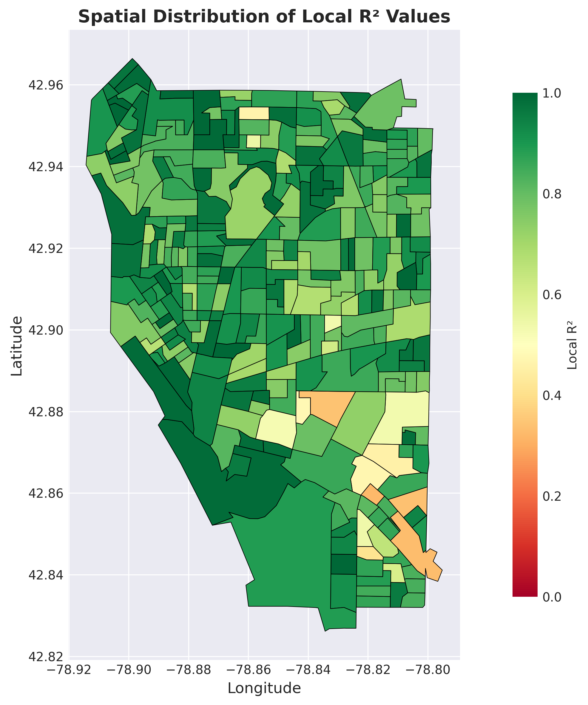
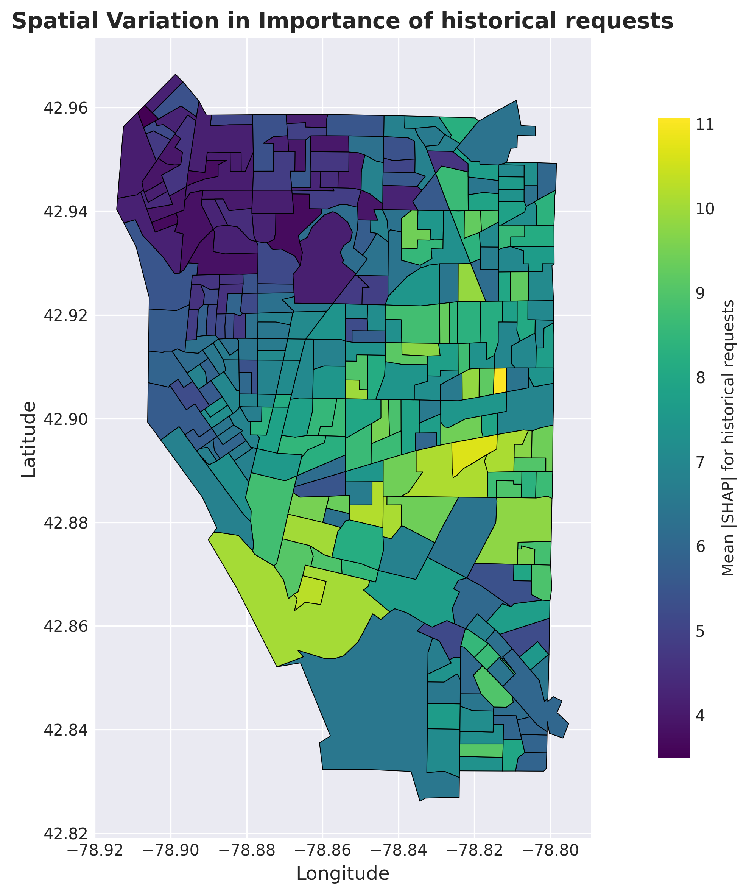

# **PyGALAX**: An Open-Source Python Toolkit for Advanced Explainable Geospatial Machine Learning

[](https://www.python.org/downloads/)
[](LICENSE)
[](https://pypi.org/project/PyGALAX/)

## Table of Contents
- [Overview](#overview)
- [Installation](#installation)
- [Repository Structure](#repository-structure)
- [Required Python Packages](#required-python-packages)
- [Basic Example - Regression](#basic-example---regression)
- [Basic Example - Classification](#basic-example---classification)
- [Visualization Examples](#visualization-examples)
- [Data Attribution](#data-attribution)
- [Contact](#contact)
- [Citation](#citation)
- [Acknowledgments](#acknowledgments)

## Overview

**PyGALAX** is an enhanced Python package implementation of the GALAX framework (**G**eospatial **A**nalysis **L**everaging **A**utoML and e**X**plainable AI) that integrates Geographically Weighted Regression (GWR), Automated Machine Learning (AutoML), and eXplainable AI (XAI) for spatial analysis. It provides a powerful toolkit for understanding spatial heterogeneity in complex geospatial datasets.

PyGALAX overcomes key limitations of traditional GWR, which captures spatial variation but is limited to linear relationships and struggles with high-dimensional feature spaces, as well as other machine-learning-enhanced GWR variants that rely on a single algorithm. PyGALAX introduces three major advances:

1. **Spatially Adaptive AutoML**: Automatically selects and optimizes the best machine learning model for each geographic location based on local data characteristics.
2. **Geographically Weighted XAI**: Provides transparent interpretations through SHAP (SHapley Additive exPlanations) at both global and local scales, revealing spatial variations in feature importance and non-linear relationships.
3. **Unified Framework**: Supports both regression and classification tasks within a single, intuitive interface.

PyGALAX builds upon and improves the GALAX framework. Critical enhancements in PyGALAX include automatic bandwidth selection and flexible kernel function selection, providing greater flexibility and robustness for spatial modeling across diverse datasets and research questions.

## Installation

### Development installation

```bash
git clone https://github.com/Pingping9/PyGALAX.git
cd PyGALAX
pip install -e .
```

## Repository Structure

```
PyGALAX/
│
├── PyGALAX/                     # Main package directory
│   ├── __init__.py
│   ├── bandwidth.py                # Bandwidth selection methods
│   ├── kernel.py                   # Spatial kernel functions
│   ├── model.py                    # Core GALAX model implementation
│   └── results.py                  # Results processing, summary, and visualization
│
├── Notebooks/                   # Jupyter notebook demonstrations
│   ├── Regression_311Request.ipynb   # Regression analysis with visualizations
│   └── Classification_311Request.ipynb # Classification analysis with visualizations
│
├── data/                        # Example datasets
│   ├── 311Request.csv          # Buffalo 311 requests (regression)
│   ├── 311Request_class.csv    # Buffalo 311 requests (classification)
│   └── buffalo/                # Buffalo vector map
│       ├── buffalo.shp
│       ├── buffalo.cpg
│       ├── buffalo.dbf
│       ├── buffalo.prj
│       ├── buffalo.sbn
│       ├── buffalo.sbx
│       ├── buffalo.shx
│       └── buffalo.shp.xml
│
├── results/                    # Example output files
│   ├── PyGALAX_regression_results.joblib
│   ├── PyGALAX_classification_results.joblib
│   ├── regression_feature.png
│   ├── regression_r2.png
│   ├── classification_precision.png
│   └── classification_feature.png
│
├── tests/                       # Unit tests for PyGALAX
│   ├── test_kernel.py         
│   ├── test_bandwidth.py       
│   ├── test_model.py           
│   └── test_results.py  
│
├── .gitignore
├── MANIFEST.in
├── pyproject.toml
├── README.md
├── requirements.txt
└── LICENSE
```

### Folder and File Descriptions

- **`PyGALAX/`**: Contains the main PyGALAX module with all classes and functions for model fitting, bandwidth selection, and result processing.

- **`Notebooks/`**: Interactive Jupyter notebooks demonstrating:
  - How to prepare data for PyGALAX
  - Model configuration and fitting
  - Performance evaluation
  - Visualization of results

- **`data/`**: Sample datasets from Buffalo 311 call requests for testing and demonstration purposes.

- **`results/`**: Example output files showing the structure of saved PyGALAX results.

- **`tests/`**: Comprehensive unit test suite covering all modules.

## Required Python Packages

```bash
pip install numpy pandas scikit-learn flaml shap libpysal esda joblib
```

Or install all dependencies at once:

```bash
pip install -r requirements.txt
```

## Basic Example - Regression

```python
import pandas as pd
from sklearn.preprocessing import StandardScaler
from PyGALAX import GALAX

data = pd.read_csv("data/311Request.csv")

columns_to_exclude = ['CBG ID', 'Lon', 'Lat', '311_requests']
x_vars = [column for column in data.columns if column not in columns_to_exclude]
scaler = StandardScaler()
X = scaler.fit_transform(data[x_vars])
y = data['311_requests'].values.reshape(-1, 1)
coords = data[['Lon', 'Lat']].values

# Configure AutoML settings
automl_settings = {
    "time_budget": 180,
    "estimator_list": ['rf', 'xgboost', 'xgb_limitdepth', 'extra_tree'],
    "task": 'regression',
    "metric": 'r2',
    "seed": 42,
    "verbose": 0,
}

# Initialize and fit GALAX model
model = GALAX(
    coords=coords,
    y=y,
    X=X,
    kernel='bisquare',
    automl_settings=automl_settings,
    task='regression',
    n_jobs=48,
    x_vars=x_vars
)

results = model.fit()
results.summary()
results.save_results('results/PyGALAX_results.joblib')
```

## Basic Example - Classification

```python
import pandas as pd
from sklearn.preprocessing import StandardScaler
from PyGALAX import GALAX

data = pd.read_csv("data/311Request_class.csv")

columns_to_exclude = ['CBG ID', 'Lon', 'Lat', '311_requests']
x_vars = [column for column in data.columns if column not in columns_to_exclude]
scaler = StandardScaler()
X = scaler.fit_transform(data[x_vars])
y = data['311_requests'].values
coords = data[['Lon', 'Lat']].values

# Configure AutoML settings
automl_settings = {
    "time_budget": 180,
    "estimator_list": ['rf', 'xgboost', 'xgb_limitdepth', 'extra_tree'],
    "task": 'classification',
    "metric": 'accuracy',
    "seed": 42,
    "verbose": 0,
}

# Initialize and fit GALAX model
model = GALAX(
    coords=coords,
    y=y,
    X=X,
    kernel='bisquare',
    automl_settings=automl_settings,
    task='classification',
    n_jobs=48,
    x_vars=x_vars
)

results = model.fit()
results.summary()
results.save_results('results/PyGALAX_results_class.joblib')
```

## Visualization Examples

PyGALAX provides rich visualization capabilities to understand spatial patterns and model behavior:

### Local Performance Metrics

*Spatial variation in R² across locations*

### SHAP Feature Importance

*Local feature importance revealed through SHAP values*

**Note**: See the Jupyter notebooks in `Notebooks/` for more visualizations using the Buffalo 311 dataset.

## Data Attribution

The example data used in this repository (Buffalo 311 call requests) is from:

**Sun, K., Zhou, R. Z., Kim, J., & Hu, Y. (2024). PyGRF: An improved Python Geographical Random Forest model and case studies in public health and natural disasters. *Transactions in GIS*, 28(7), 2476-2491.**

## Contact

For questions, suggestions, or collaborations, please contact:

- **Pingping Wang** [pingpingwang@txstate.edu]
- **Dr. Yihong Yuan** [yuan@txstate.edu]

## Citation

If you use PyGALAX, the code from this repository, or from GALAX, please cite the following papers:

```bibtex
Wang, P., Yuan, Y., Li, L., & Lu, Y. (2025). GALAX: A Framework for Geospatial Analysis Leveraging AutoML and eXplainable AI. Annals of the American Association of Geographers, 1–27. https://doi.org/10.1080/24694452.2025.2591684
```

## Acknowledgments

The first and second authors received funding support from the Texas State University College of Liberal Arts 2024-2025 Research Seed Grant.

---

For the original research framework and methodology, please visit the [GALAX repository](https://github.com/Pingping9/GALAX-aaag).
